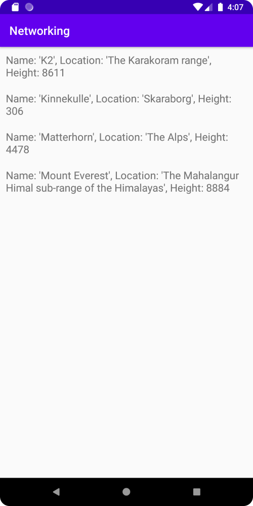

# Rapport

Först lades en RecyclerView widget till i "activity_main.xml".

Koden ser ut som följande:

```
<androidx.recyclerview.widget.RecyclerView
        android:id="@+id/recycler_view"
        android:layout_width="match_parent"
        android:layout_height="match_parent"
        app:layout_constraintBottom_toBottomOf="parent"
        app:layout_constraintLeft_toLeftOf="parent"
        app:layout_constraintRight_toRightOf="parent"
        app:layout_constraintTop_toTopOf="parent" />
```

Sedan lades en dependency till inuti "build.gradle". Detta gjordes för att kunna använda RecycleView.

Koden ser ut som följande:

```
implementation 'androidx.recyclerview:recyclerview:1.2.1'
```

Efter detta lades en ny klass "Mountain" till, vilket skall representera berg.
Berg kan ha ett namn, en plats, och en höjd.

Koden ser ut som följande:

```
package com.example.networking;

import com.google.gson.annotations.SerializedName;

public class Mountain {
    private String name;
    private String location;
    @SerializedName("size")
    private int height;

    public Mountain(String name, String location, int height) {
        this.name = name;
        this.location = location;
        this.height = height;
    }

    @Override
    public String toString() {
        return "Name: '" + name + '\'' +
                ", Location: '" + location + '\'' +
                ", Height: " + height;
    }
}
```

Sedan skapades en ny xml fil, "mountain_item.xml". Denna används för att representera hur berg skall visas inuti RecycleViewen.
En LinearLayout används tillsammans med en TextView.

Koden ser ut som följande:

```
<?xml version="1.0" encoding="utf-8"?>
<LinearLayout xmlns:android="http://schemas.android.com/apk/res/android"
    android:layout_width="match_parent"
    android:layout_height="wrap_content"
    android:orientation="horizontal"
    android:padding="10dp">

    <TextView
        android:id="@+id/mountain"
        android:layout_width="wrap_content"
        android:layout_height="wrap_content"
        android:textSize="18sp" />

</LinearLayout>
```

Sedan skapades en adapter till RecycleViewen. Adaptern används för att bestämma vad som skall visas inuti RecycleViewen,
och lägger till "klick" funktionalitet till bergen.
Det är för mycket kod för att lägga till här, så en liten del visas bara.
Adaptern använder "mountain_item.xml" för att bestämma hur berg skall visas inuti RecycleViewen.
Adaptern använder även "toString" metoden i "Mountain" klassen för att hämta information om berg i form av en sträng, och visar sedan upp detta.

Koden ser ut som följande:

```
public ViewHolder onCreateViewHolder(@NonNull ViewGroup parent, int viewType) {
        return new ViewHolder(layoutInflater.inflate(R.layout.mountain_item, parent, false));
    }

public void onBindViewHolder(ViewHolder holder, int position) {
        holder.mountain.setText(items.get(position).toString());
    }
```

RecycleViewen etablerades sedan i "onCreate" metoden intui "MainActivity.java" för att skapas när appen startas.

Koden ser ut som följande:

```
private RecyclerViewAdapter adapter;
private ArrayList<Mountain> items;

adapter = new RecyclerViewAdapter(this, items, new RecyclerViewAdapter.OnClickListener() {
            @Override
            public void onClick(Mountain item) {
                Toast.makeText(MainActivity.this, item.toString(), Toast.LENGTH_SHORT).show();
            }
        });

RecyclerView view = findViewById(R.id.recycler_view);
view.setLayoutManager(new LinearLayoutManager(this));
view.setAdapter(adapter);
```

Efter detta behövdes berg. Bergen hämtas från "FamousPeaksJSON URL" i form av en JSON sträng.
När appen skapas hämtas JSON strängen genom en kod bit i "onCreate" metoden, och en variabel som innehåller korrekt URL.

Koden ser ut som följande:

```
private final String JSON_URL = "https://mobprog.webug.se/json-api?login=brom";

new JsonTask(this).execute(JSON_URL);
```

Sedan sparas den informationen inuti en ArrayList "items". Adaptern uppdaterar sedan sig själv och innehållet inuti RecycleViewen.

Koden ser ut som följande:

```
public void onPostExecute(String json) {
        Type type = new TypeToken<List<Mountain>>() {
        }.getType();
        items = gson.fromJson(json, type);

        adapter.setItems(items);
        adapter.notifyDataSetChanged();
}
```

Internet tillåtelse lades även till inuti "AndroidManifest.xml".

Koden ser ut som följande:

```
<uses-permission android:name="android.permission.INTERNET" />
```

Appen ser ut som följande:



